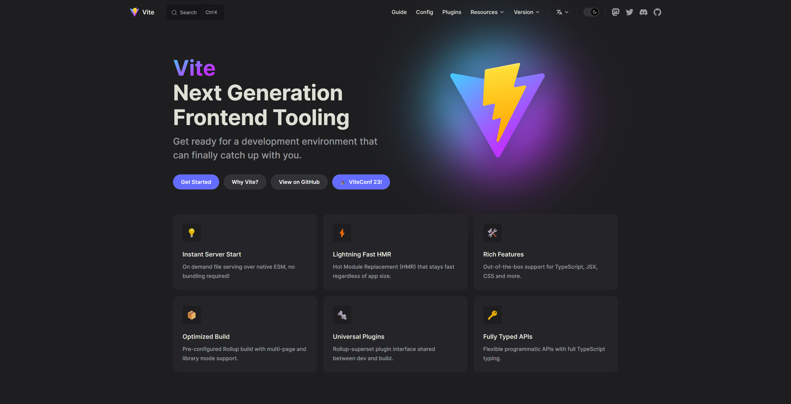

# Fullstack Course: React + NodeJS + Docker 
## Day 1 : 22/08/2023
1. ติดตั้งเครื่องมือ เช่น Docker Desktop, Node.JS, VSCode, Git
2. สร้าง Workshop โปรเจ็กต์ React 18 ด้วย Vite ทำงานบน Docker Container
3. ใช้ React ออกแบบ UI ด้วย material UI(MUI))
4.  สร้าง Workshop Rest API ด้วย Strapi CMS V.4

---
[]()
- [ ] 1. *ติดตั้งเครื่องมือ เช่น Docker Desktop, Node.JS, VSCode, Git*
- VS Code
	 **Extension**
	 - Color Picker
	 - Material Icon Theme
	 - ES7 React/Redux/GraphQL/React-Native snippet
	 - html to JSX
	 - Prettier - Code formatter
	 - Docker
	 - Rainbow Brackets 2
	 - Auto Import
	 - One Dark Pro
 
 **การตั้งค่า Workspace บน VS Code ด้วยโฟลเดอร์ .vscode**
> .vscode/extensions.json
 ```json
{
  "recommendations": [
    "anseki.vscode-color",
    "pkief.material-icon-theme",
    "rodrigovallades.es7-react-js-snippets",
    "riazxrazor.html-to-jsx",
    "esbenp.prettier-vscode",
    "ms-azuretools.vscode-docker",
    "tejasvi.rainbow-brackets-2",
    "steoates.autoimport",
    "zhuangtongfa.material-theme"
  ]
}
 ```
> .vscode/settings.json
```json 
{
  "emmet.syntaxProfiles": {
    "javascript": "jsx"
  },

  "emmet.includeLanguages": {
    "javascript": "javascriptreact"
  },

  "emmet.showAbbreviationSuggestions": true,
  "emmet.showExpandedAbbreviation": "always"
}
```
---
[]()
- NodeJS 18.17.1
	- [Windows / Mac / Linux](https://nodejs.org/en/download)
- Google Chrome
	- [Windows / Mac / Linux](https://chromeenterprise.google/browser/download/#windows-tab)
- Git
	- [Windows / Mac / Linux](https://git-scm.com/downloads)
> Additional: GitHub Account

---

[]()

- [ ] 2. *สร้าง Workshop โปรเจ็กต์ React 18 ด้วย Vite ทำงานบน Docker Container* 
 
 ***VITE***
> สร้างโปรเจคค  # Vite requires [Node.js](https://nodejs.org/en/) version 18+,  20+
 
```bash [NPM]
npm create vite@latest
```

```bash [Yarn]
yarn create vite
```

```bash [PNPM]
pnpm create vite
```

*Vite Shortcut*
```bash
# npm 6.x
npm create vite@latest my-react-app --template react

# npm 7+, extra double-dash is needed:
npm create vite@latest my-react-app -- --template react

# yarn
yarn create vite my-react-app --template react

# pnpm
pnpm create vite my-react-app --template react
```
---
[]()

- Docker Desktop
	- [Windows / Mac / Linux](https://www.docker.com/)
 
***Docker***
> สร้างไฟล์ Dockerfile

```yaml
# Pull the base image
FROM node:18.16.0-alpine
# Set the working directory
WORKDIR /usr/app
# Copy app dependencies to container
COPY ./package*.json ./
# Install dependencies
RUN npm install
# Copy code from host to container
COPY . .
# Expose Port
EXPOSE 5173
# Deploy app for local development
CMD [ "npm","run","dev" ]
```

***Docker Compose***
> สร้างไฟล์ docker-compose.yml
```yaml
version: '3.9'
# Network
networks:
    web_network:
        name: reactdockervite
        driver: bridge

services:
# React App Service
    reactapp:
        build:
            context: .
            dockerfile: Dockerfile
        container_name: reactapp_vite
        restart: always
        volumes:
            - ./:/usr/app
            - /usr/app/node_modules
        ports:
            - 5173:5173
        environment:
            - CHOKIDAR_USEPOLLING=true
        networks:
            - web_network
```

***Docker Command***

|             Description              |                Command                 |
| :---------------------------------: | :---------------------------------------: |
| Check valid docker-compose file | ``` docker-compose config -q ```|
| Create Container | ```docker-compose up -d``` |
| Remove Container | ```docker-compose down --rmi all``` |
| Follow Logs in container | ```docker-compose logs -f [service_name]``` |
| List Container Status | ```docker-compose ps``` |
| Stop/Start Container |  ```docker-compose stop/start```  |
| Restart Container | ```docker-compose restart```  |
| Exec to container | ```docker exec -it [container_name] sh``` |

---

[](https://mui.com/material-ui/)  

- [ ] 3. ใช้ React ออกแบบ UI ด้วย material UI(MUI)) 

## Installation
*ติดตั้ง MUI*
> npm
```npm
npm install @mui/material @emotion/react @emotion/styled
```

> yarn
```yarn
yarn add @mui/material @emotion/react @emotion/styled
```

> pnpm
```pnpm
pnpm add @mui/material @emotion/react @emotion/styled
```

*ติดตั้ง Sass*

```npm
npm install sass -D
npm install sass -D
```

*สร้างไฟล์ Style.scss*
```scss
.myStyle {
color: teal;
font-size: 30px;
border:2px solid #61dafb;
border-radius: 10px;
padding: 10px;
text-align: left;
}
```

*เรียกใช้งาน Style.scss*
```ts
import React from "react";
import "./Style.scss";
function App() {
  return (
    <div>
      <p>
        คนจะเจ้าชู้ต้องดูที่อะไร <br />
        คนจะหลายใจต้องดูอะไรบ้างหนา
        <br />
        ดูที่รอยยิ้มหรือดูที่ใบหน้า
        <br />
        ดูที่ดวงตาหรือดูที่อะไร
      </p>
    </div>
  );
}
```
---
[]()  

- [ ] 4. สร้าง Workshop Rest API ด้วย Strapi CMS V.4

 ***ติดตั้ง Strapi***
  > npm
 ```npm
npx create-strapi-app@latest my-project --quickstart
```
 > yarn
```yarn
yarn create strapi-app my-project --quickstart
```
 ***ลงทะเบียนผู้ใช้ผู้ดูแลระบบรายแรก***

[]()  
